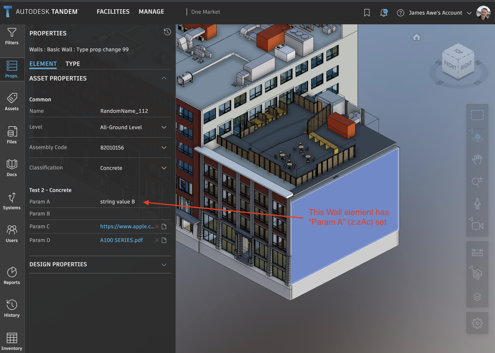
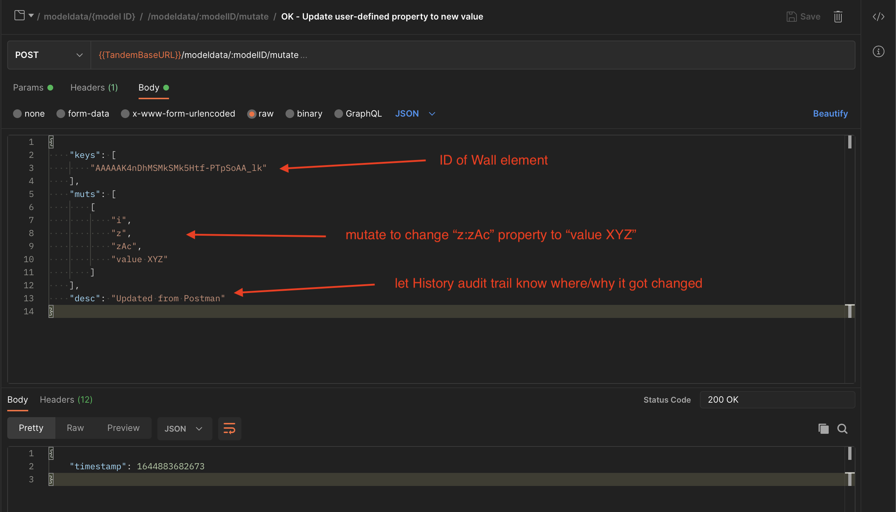
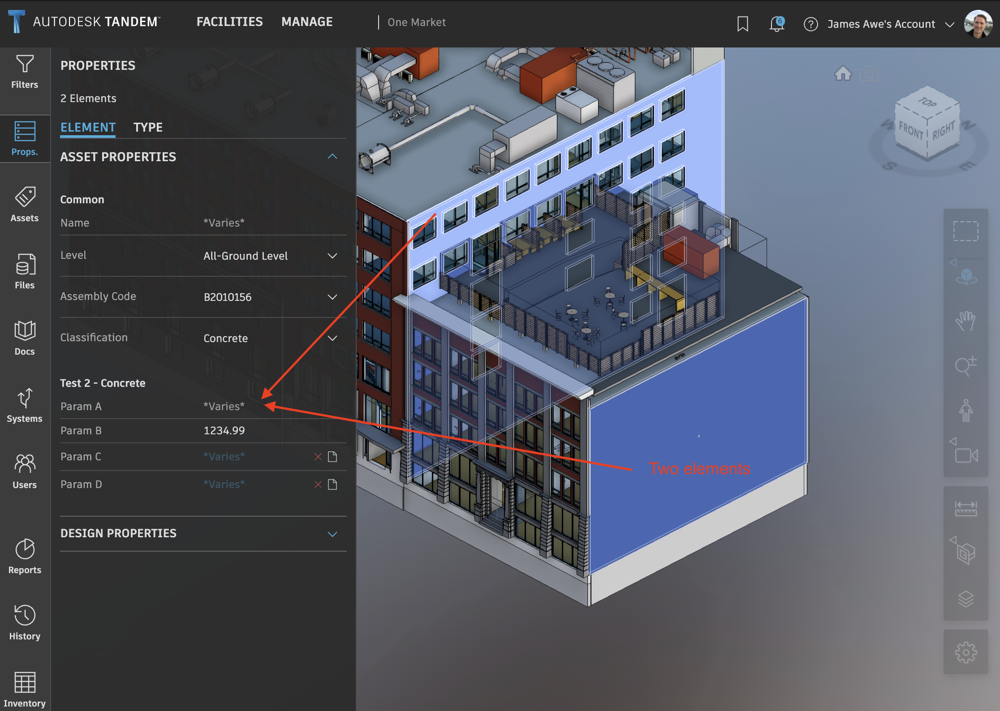
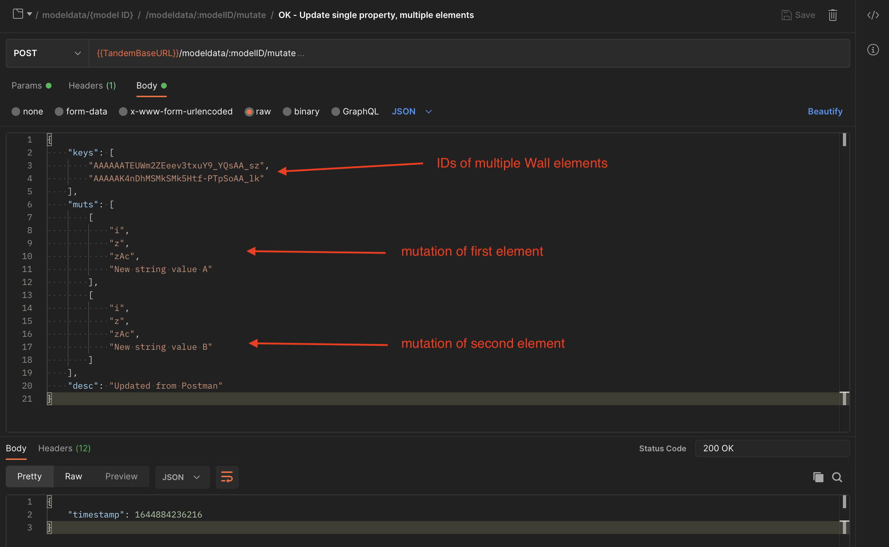
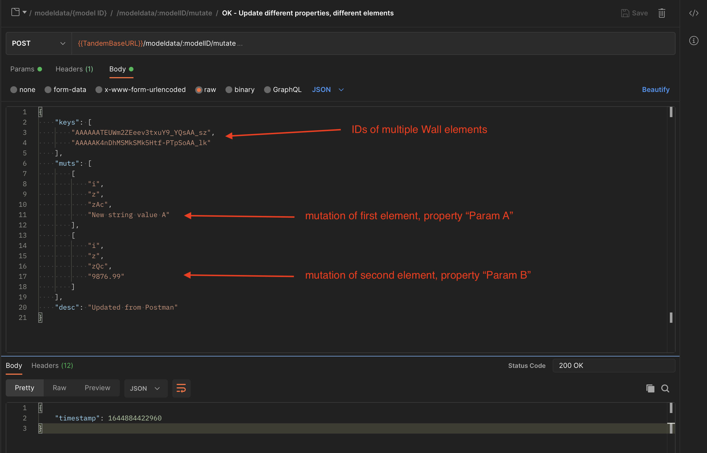

## Write properties - /mutate

The /mutate endpoint is used to update property values in the Tandem database.  It is currently designed to be efficient for bulk updates from the Tandem client app and is therefore somewhat cryptic.  It takes several arguments of arrays that are expected to match in length:

- "keys:" is an array of element IDs to change.  
- "muts:" is an array of matching mutations for each of the elements listed in "keys:". Therefore, the length of the "keys" array and the "muts" array must match.  

Each entry in the "muts:" array has the following:  
- operation: "i" indicates that this is an insert/update operation on the database, or "d" indicates that this is a delete operation on the database.  
- column family: "z" indicates that this is a user-defined property (Column Family)  
- column name: "xyz" is the identifier for that user-defined property  
- value: "new value" is the new value for this property  

_NOTE: there are other Column Family specifiers that can be used, but most are read-only properties and are reserved for internal use. API users will probably ONLY use "i" and "z" for the first two arguments._

- "desc": is an optional string that can be used to tell the Change History mechanism where/why these changes were made.  In our examples, we will use "Updated from Postman" to show that it was not the Tandem product that updated the value.

Let's suppose we want to mimic the behavior of the Properties panel in Tandem.  In the following example, we have a single Wall element selected, and we can see its current value.

We can change that value using the /mutate endpoint as follows

If we want to change multiple elements at the same time...

We would make a call that looks something like this...

Note that the /mutate endpoint can take any combination of mutations as long as they are properly constructed.  As an example here is one where we change the "Param A" (z:zAc) of one element, and change "Param B" (z:zQc) of the other element.

_NOTE: /mutate works on a per-model basis, so if you have 3 models loaded and have elements from each model you want to change properties for, you need to call it 3 separate times._

