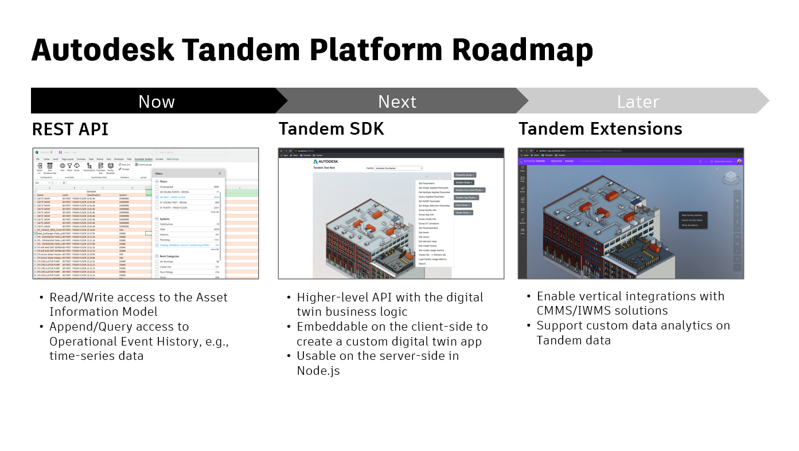

## Autodesk Tandem APIs

Tandem digital twins represent a hub of information about your facility and they establish the existence and location of assets within that facility. That foundation is critical, but any good digital twin will include integrations with other systems and will support programmatic management of the asset data. Therefore, API access to the Tandem data model is essential.  Over time, we plan to offer comprehensive APIs in several contexts to help developers customize and extend the foundational capabilities that the Tandem product provides.

Sample code for each API context exists on GitHub: [Tandem API Samples](https://github.com/autodesk-tandem)

_NOTE: Currently, these samples are marked "Private". To gain access, you will need to request that we add your GitHub username to the repository._

The main read/write functions will not be very interesting until you learn how to setup a Facility, create user-defined Parameters, and map those parameters to assets using Classifications in a Facility Template.  To learn how to do that and to get started with the product, you can get started with the product, visit: [intandem.autodesk.com](https://intandem.autodesk.com/)

# REST API
The REST API is the first one that will be officially supported.  It is the base level API that communicates with the Tandem data server and manages create/read/write/delete of property data for assets. These asset properties are also called "parameters" in the Tandem client app, and those names are interchangeable in this documentation.

The REST API is a thin layer over the underlying Tandem database.  It is designed to be very efficient and powerful, but with that comes some slightly cryptic payloads and some calls that could cause unwanted changes to the facility data if not constructed properly.  We advise that you avoid calling endpoints that we mark with WARNINGs, and we advise that you do comprehensive testing on datasets that you can afford to recreate before deploying on critical datasets.

In general, the recommendation is to use the Tandem client application to setup Facilities and create Parameters. Then once a Facility is setup, use the REST API to read/write asset properties or assign classifications to assets.

A Postman collection is provided to allow interactive testing of the REST APIs.  It also has sample payloads that explain the various options. Details on how to use the Postman collection can be found here: [Tandem Postman Collection](API_postman.md).  The Postman collection also includes basic documentation for each REST endpoint.

Additional notes about calling the most commonly used endpoints for read/write of asset properties, and for assigning classifications to assets can be found here:

- Read/Query properties (/scan): [Read](API_scan.md)
- Write properties (/mutate): [Write](API_mutate.md)
- Classification assignment: [Classification](API_classification.md)
- Qualified Property Names (/attrs)[QualifiedProperties](API_attrs.md)

# Javascript SDK

blah, blah, blah

# Tandem Plug-ins

blah, blah, blah
